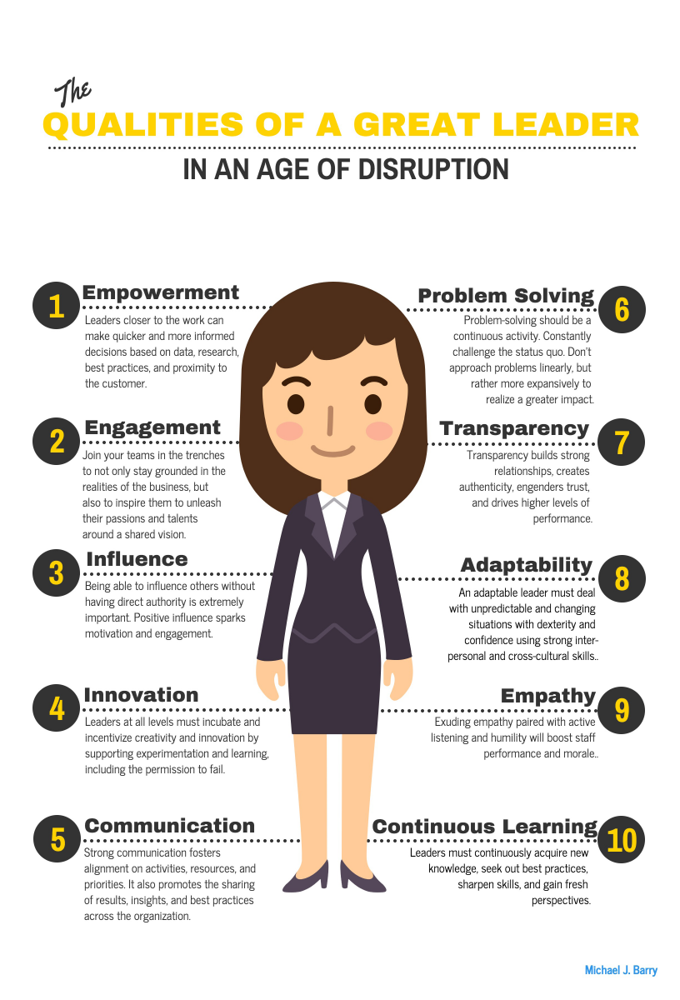

# Open Mic 
SEND US YOUR BLOG FOR CONSIDERATION! 

# Leadership in an age of disruption 
### BY MICHAEL BARRY 
(page 1 of 2)

Fasten your seatbelt. Constant change in the workplace is the new norm. From company restructuring to digital
transformations to changing consumer preferences and expectations, companies are operating in an environment of
constant change, uncertainty, and ambiguity.

To thrive in such an environment, businesses must become more flexible and adaptable. Ushering in a nimble
business model, however, will require a different approach to leadership. This article offers a perspective on
leadership in an age of disruption and what’s at stake for those who don’t get it right.

## An agile leadership model 
In today’s fast-paced, hypercompetitive global economy, leaders are being challenged
with delivering greater value to the customer while simultaneously building a stronger company culture where
employees feel a sense of purpose and fulfillment.

Speed and agility will trump perfection as businesses are pressured to address these challenges with faster
innovation, an enhanced end-to-end customer experience, cost reductions, etc. — calling on leadership to be
more agile and efficient. Traditional command and control leadership approaches are slow, rigid, and stifle
creativity and innovation; hence, they are becoming quickly outdated, and, in their place, more agile
leadership models are emerging — comprised of high levels of collaboration, engagement, empowerment, and
communication within a decentralized decision-making framework.

Ten progressive leadership qualities best define an agile leadership model. These qualities are critical in
today’s disruptive environment and are required to attain speed, efficiency, creativity, innovation, and
results.

## Leadership today is a team sport 
The ivory tower must crumble. With the increasing complexity of business
today, it is even more dangerous for leaders at any level to disengage from the realities of the business,
leading to poor decision-making and a host of other serious consequences. Decentralized leadership empowers
leaders closer to the work to make faster and more informed decisions based on data, research, best practices,
and proximity to the customer. Disruption will prevent businesses from staying idle, so leaders closer to the
work must deal with unpredictable and changing situations with dexterity and confidence, quickly shifting
priorities employing strong interpersonal and cross-cultural skills.

Empowerment, however, is not enough — rallying teams around a shared vision will require leaders to engage and
inspire those they lead. Leaders at every level must join their teams in the trenches, reinforcing the vision
and motivating and coaching employees through change and uncertainty to fully unleash their passions and
talents. Exuding empathy paired with transparency, active listening, and humility will also boost staff
performance and morale.

Communication, collaboration, negotiation, and influence across functional boundaries (horizontal) and up and
down the chain of command (vertical) are more critical than ever. In fact, agile leadership will fail without
superb communications at all levels. Solid communication helps foster alignment on activities, resources, and
priorities. It also promotes the sharing of results, insights, and recommendations, and helps replicate best
practices across the organization.

With so much work being done cross-functionally, across borders, and in a matrixed environment, leaders must
also be able to lead and influence others without having direct authority. To succeed, they must skillfully
unite disparate and sometimes competing departments and adapt to different styles and personalities while
developing a deeper understanding of other functional areas.

(Continued)

(page 2 of 2)

## A new approach to problem solving
The pressure to keep pace with rising customer expectations is causing organizations of all sizes to problem solve through creativity and innovation. In a command and control leadership structure, employees simply wait for the directives to trickle down from the top. In contrast, leaders who are closer to the work and engaged with their frontline employees will be in the best position to incubate a culture of creativity and innovation by supporting experimentation and learning, including the permission to fail. Sponsoring centers of excellence can further accelerate creativity and innovation.

Leaders today must embrace continuous problem solving to get ahead of emerging issues before they become serious. To do so, leaders need to think more expansively by moving past the scope of the immediate problem to instead focus on holistic, creative, and sustainable solutions that will achieve a greater impact.

Continuous learning is no longer optional, regardless of title. Without it, leaders today risk being an expert one day and a novice the next. Continuous learning, inextricably linked to problem solving, involves acquiring new knowledge, seeking out best practices, keeping current skills sharp, and gaining fresh perspectives.

## What’s at stake?
Organizations need to get this right because their two most important stakeholder groups — customers and employees — have high expectations for leaders.

Customers are more empowered and savvy than ever before with expectations that transcend a brand name and product performance. Customers today are clamoring for a total experience, raising the bar even higher for brands. Leaders are challenged with creating an authentic brand experience, providing relevant solutions, engaging customers, listening and acting on customer feedback, and continuously innovating.

It’s not a cliché — employees are a company’s most important asset. Leadership that is absent purpose, transparency, empowerment, and engagement will cost the business handsomely. Employees will slowly disengage, impacting creativity and innovation, resulting in significant disruption and lost opportunity costs that should raise the alarm of the CFO. With the help of platforms like Glassdoor and Google, the employer brand will suffer as the company finds it increasingly difficult to attract talent.

We can all take steps to become better leaders. Take a moment to reflect on your own leadership style. Are you prepared to effectively lead in an age of disruption? What measures can you take to improve? Your bosses, employees, peers, customers, and suppliers will appreciate you more for it.

Michael Barry is a marketing and communications strategist. He has an MBA in international management (University of Dallas) and a BA in economics (University of Dallas).

